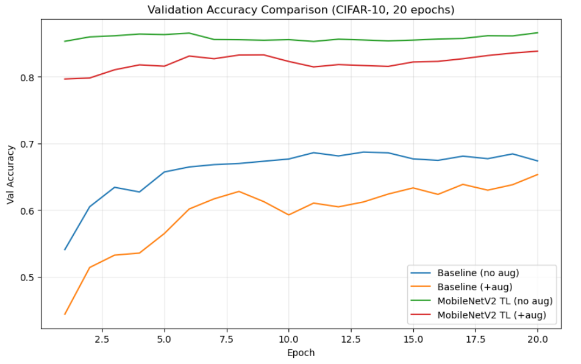
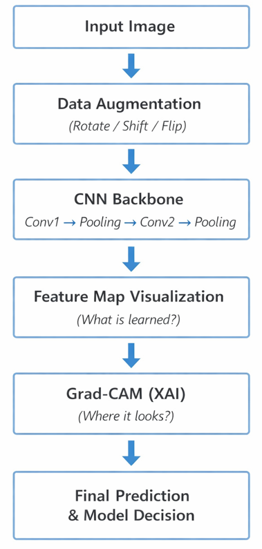
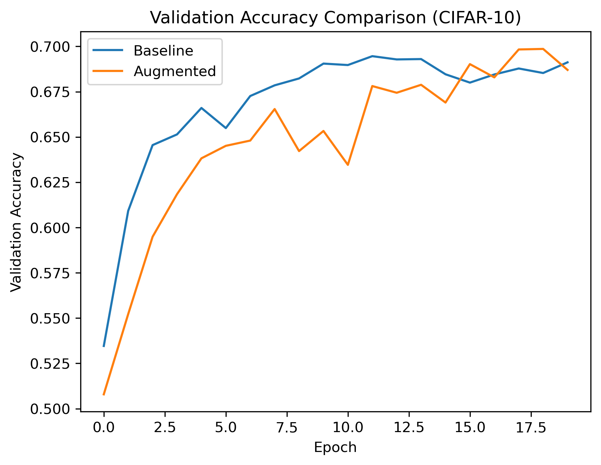
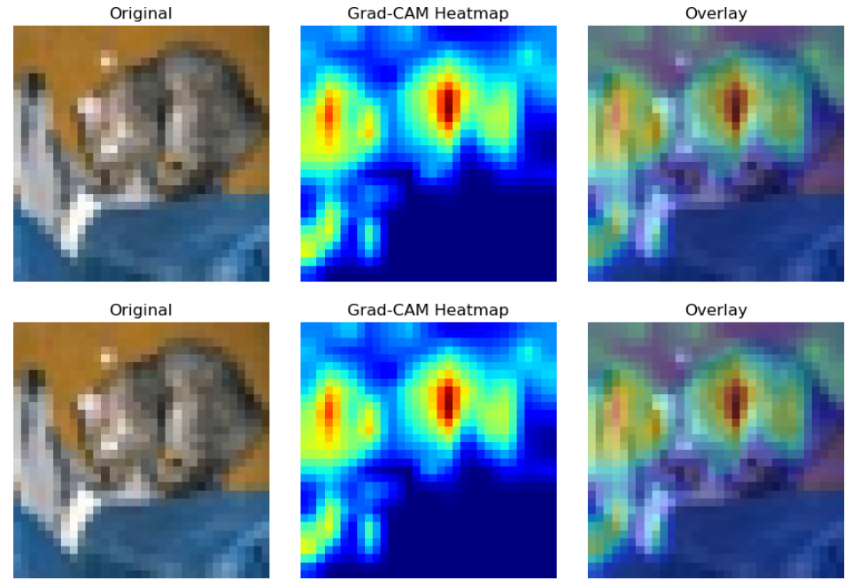
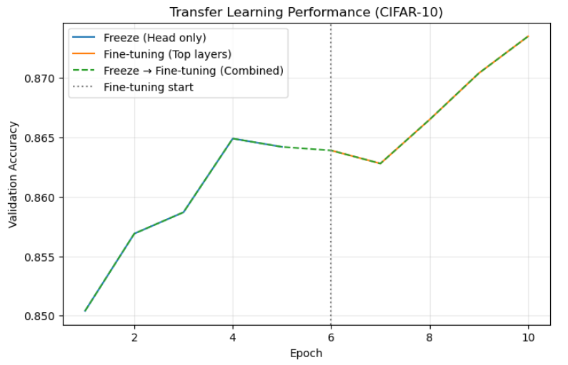

# 📌 CNN Data-Centric Image Classification Project
**– 少量データ環境における汎化性能向上への段階的アプローチ**

---

## 📌 One-Line Summary
**単なるAccuracy比較に留まらず、  
CNNが「何を学習し」「どこを見て判断しているか」まで検証した  
データ中心(Data-Centric)画像分類プロジェクト**

---

## 📊 Final Result at a Glance
> **Best Performance:** Data Augmentation + Transfer Learning

---

## 🔍 プロジェクト目的
**少量データ環境において、CNNの画像分類性能をどのように効果的に向上させるか？**

画像データが少ない場合、CNNは特定のパターンを記憶（過学習）しやすく、  
**未知データに対する汎化性能が低下する問題**が発生する。

本プロジェクトでは、**モデルを闇雲に複雑化する前に**、  
**データ中心（Data-Centric）アプローチ**を用いて  
この問題を解決することを目的とする。

---

## 🧪 実験環境
- **Dataset**: CIFAR-10（32×32 RGB）
- **Models**: Custom CNN, MobileNetV2（Transfer Learning）
- **Framework**: TensorFlow / Keras
- **Evaluation**: Accuracy, Feature Map可視化, Grad-CAM

---

## 🔄 Project Pipeline
以下は、本プロジェクト全体の実験フローを要約したパイプラインである。

- Data Augmentationによる入力データの多様化  
- CNN内部における特徴学習過程の分析  
- Grad-CAMを用いたモデル判断根拠の可視化  
- 最終的な性能比較と意思決定  

---

# 🧩 Notebook構成および実験内容

## 📘 Notebook 1  
### Baseline CNN vs Data Augmentation 適用比較

### 🔹 背景
CIFAR-10はCNN学習が可能なデータセットであるが、  
**クラス多様性およびデータ量が十分とは言えず、過学習が発生しやすい**。

### 🔹 アプローチ
- Baseline CNNモデルの学習
- 同一モデルに対して **Data Augmentation** を適用
  - 回転（Rotation）
  - 平行移動（Shift）
  - 反転（Flip）

### 🔹 結果比較

### 🔹 結果解釈
- **Baseline**
  - 学習初期に高速収束
  - 高い初期Accuracy
  - → 学習しやすいパターンを早期に記憶
  - → 後半では新たに学習する特徴がなく性能が停滞

- **Augmentation適用**
  - 学習初期は収束が遅い
  - Epoch増加に伴い性能が継続的に向上
  - → 同一オブジェクトを多様な形で観測
  - → 変化しない **本質的特徴（Invariant Feature）** を学習

📌 **結論**  
入力は変化してもクラスの本質は変わらないため、  
モデルは徐々に汎用的な特徴に集中する。

---

## 📘 Notebook 2  
### なぜAugmentationは汎化性能を向上させるのか？（Feature Map可視化）

### 🔹 目的
単なるAccuracy比較に留まらず、  
**CNN内部で実際にどのような特徴が学習されているかを視覚的に確認**する。

### 🔹 Conv Layerにおける階層的特徴学習
- **Conv1**
  - エッジ、色コントラスト、明度変化  
  - 低レベル特徴（Low-level features）

- **Conv2**
  - エッジの組み合わせ  
  - テクスチャ、繰り返しパターン、部分構造  
  - 高レベル特徴（High-level features）

### 🔹 Feature Map可視化結果

📌 **結論**  
PoolingはAugmentationによる位置変動（shift）を自然に吸収し、  
モデルが位置に対して頑健な表現を学習することを助ける。

---

## 📘 Notebook 3  
### モデルはどこを見て判断しているのか？（Grad-CAM）

### 🔹 目的
モデルが「正解した」こと以上に重要なのは、  
**「なぜその判断に至ったのか」**である。

### 🔹 Grad-CAM可視化

📌 **結論**  
モデルの予測はランダムではなく、  
視覚的に意味のある領域に基づいて判断されていることを確認した。

---

## 📘 Notebook 4  
### 拡張：Transfer Learningの適用

### 🔹 アプローチ
- **MobileNetV2**
  - ImageNetによる事前学習
  - 軽量かつ情報損失を抑えた構造

### 🔹 方法
- Feature Extractor部分を **Freeze**
- Classification Headのみ **Fine-tuning**

### 🔹 結果

📌 **結論**  
Transfer Learningは少量データ環境において、  
安定した性能向上をもたらす有効な手法である。

---

## 📘 Notebook 5  
### 最終比較および結果整理

### 🔹 実験構成
1. Baseline（No Augmentation）
2. Baseline + Augmentation
3. Transfer Learning（No Augmentation）
4. Transfer Learning + Augmentation

### 🔹 最終Accuracy比較

📌 **Data Augmentation + Transfer Learning** の組み合わせが  
最も安定かつ高い性能を示した。

---

# ✅ 最終結論
- 少量データ環境では  
  **モデル複雑化よりもデータ戦略が重要**
- Data AugmentationはCNNの汎化性能を大きく向上させる
- Feature MapおよびGrad-CAMにより学習根拠を検証できた
- Transfer Learningは実務的に最も効果的な拡張戦略である

---

## 📌 One-Line Summary
**CNNの性能向上に留まらず、  
モデルが何を学習し、どのように判断しているかまで  
データ中心で検証した画像分類プロジェクト**
